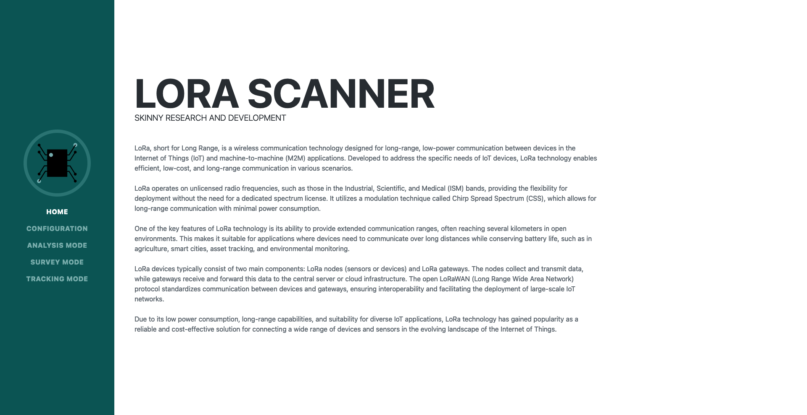
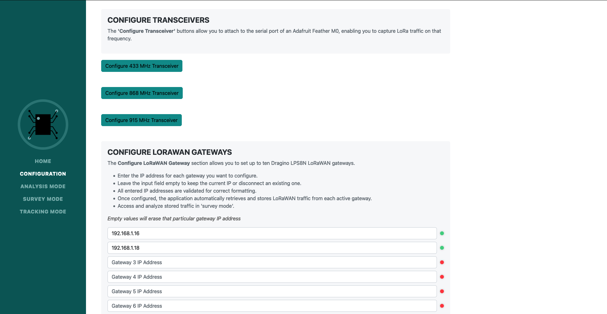
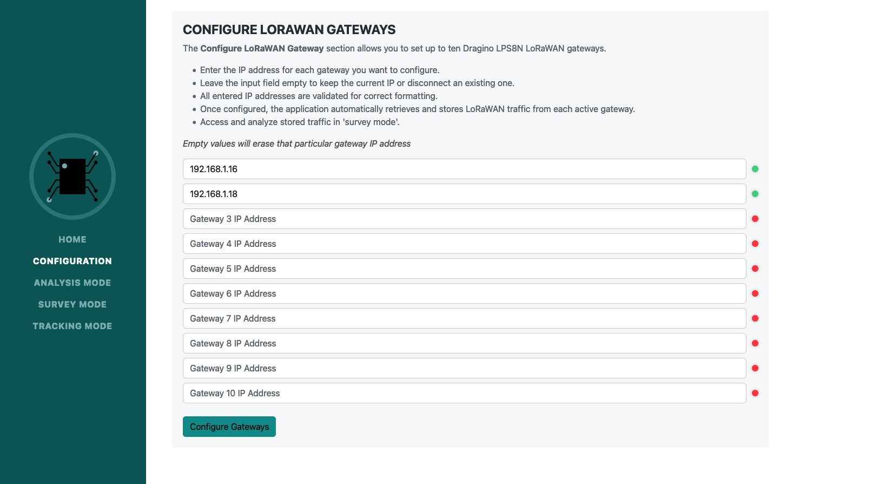

# Skinny R&D Lora Scanner 



## Introduction
The Lora Scanner is a Flask web application integrated with SocketIO, designed for monitoring and analyzing LoRa (Long Range) wireless communication.

## Features

* **Packet Streaming**: View a live stream of each raw LoRa packet captured and received by the LoRa Scanner with `Analysis Mode`.
* **Supported Frequencies**: Capture packets at 915, 868, or 433 MHz
* **Device Tracking**: Track down LoRa Devices in the area using `Tracking Mode`.
* **Packet Analysis**: View every packet captured by the LoRa scanner with `Survey Mode`.
* **Exporting Data**: Perform AI powered data analysis on LoRa packets by downloading them from the `Survey Mode` page.
* **LoRaWAN Support**: Integrated LoRaWAN support with the Dragino LPS8N Indoor LoRaWAN Gateway.
* **Hardware Support**: The LoRa Scanner is currently designed to work with an `Adafruit Feather M0` or `32u4`.

## Installation

### Hardware Requirements

Flash your Adafruit Feather M0 (or 32u4) with the Skinny LoRa firmware.  You can attach up to three different receivers at a time.  For instructions, please follow the steps 1-2 [here](https://github.com/skinnyrad/Skinny-LoRa). 

*Note: For 433 MHz analysis you need the `Adafruit Feather M0 LoRa 433 MHz`*

### Prerequisites
- Python 3.x
- pip (Python package manager)
- Virtual environment (recommended)

### Setup For Linux, MacOS, and Windows 
1. Navigate to the application directory:
   ```
   cd lora-scanner
   ```
2. Create a virtual environment (optional):
   ```
   python -m venv venv
   ```
3. Activate the virtual environment (optional):

- Windows: `venv\Scripts\activate`
- macOS/Linux: `source venv/bin/activate`

4. Install the required packages:
   ```
   pip install -r requirements.txt
   ```

## Usage

1. Run the application:
```bash
python app.py
```
2. Access the web interface at `http://localhost:5000`.


## Configuration



From the configuration page, you can connect to a LoRa transmitter to start sending and receiving messages. Select the desired frequency to begin. Click the 'Select Device' button to connect to a serial port on your computer (where your Feather is attached). Once connected, traffic from your LoRa receiver will automatically stream to the web page for analysis. To disconnect a receiver, click the 'Disconnect Device' button. You can connect up to three LoRa transmitters at once.


#### Configure LoRaWAN Gateways

The 'Configure LoRaWAN Gateway' section allows you to set up to ten Dragino LPS8N LoRaWAN gateways.

- Click the "Configure Gateway" button to start configuring each gateway's IP address.
- Skip configuring a gateway or disconnect an existing one by leaving the input field empty.
- All entered IP addresses are validated for correct formatting.
- Once configured, the application automatically retrieves and stores LoRaWAN traffic from each active gateway.
- Access and analyze stored traffic in 'survey mode'.



## Analysis Mode

Analyze LoRa traffic received at 433, 868, or 915 MHz with ‘Analysis Mode’. Click the desired frequency to get started.  Once connected to your LoRa receiver, traffic will automatically be streamed to the web page for analysis. To disconnect a receiver, click the 'Disconnect Serial Port' button.


You can view and inspect any received packets from the analysis window in the appropriate section:


From analysis mode you can also transmit a message at the desired frequency using the ‘Transmit Data’ button.  


## Tracking Mode

Tracking mode allows you to track down rogue LoRa transmitters by locking in on a particular LoRa device and receiving live updates of their RSSI values.  From the main tracking mode screen, click the row containing the LoRa transmitter you are searching for and it will lock in on that particular device for seamless tracking.


If you toggle the beacon buttons at the bottom of the screen, you will find a similar interface to the ‘Analysis Mode’ page.  From this window you will be able to see live traffic received from the LoRa transceivers you have attached to the scanner.  If you would like to beacon a message at a desired frequency, you can use the ‘Start Beacon’ and ‘Stop Beacon’ buttons.  This will allow you to transmit a custom LoRa message at any desired interval , in an attempt to probe any LoRa devices that might be listening for messages:


## Survey Mode

Survey mode allows you to view all of the devices and corresponding packets discovered by the LoRa scanner.


From the main ‘Survey Mode’ screen, you can view plaintext messages that were successfully decoded by the LoRa scanner using the ‘Show Values’ button next to a desired LoRa device.  After clicking the button, all of the messages captured from that particular device will be displayed.  Each row represents a single message captured from that device.


To collapse the packet list, click the ‘Hide Values’ button.


## Exporting LoRa Traffic

To download all packets captured by the LoRa Scanner, click the ‘Download Packets’ button.  This will export all packets into a CSV file.


